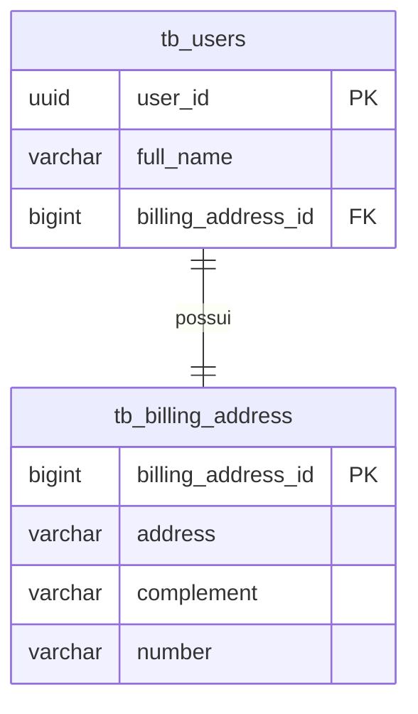

# Diagrama Entidade Relacionamento

```mermaid
erDiagram
    tb_users {
        uuid user_id PK
        varchar full_name
        bigint billing_address_id FK
    }

    tb_billing_address {
        bigint billing_address_id PK
        varchar address
        varchar complement
        varchar number
    }


    tb_users ||--|| tb_billing_address : possui
```
