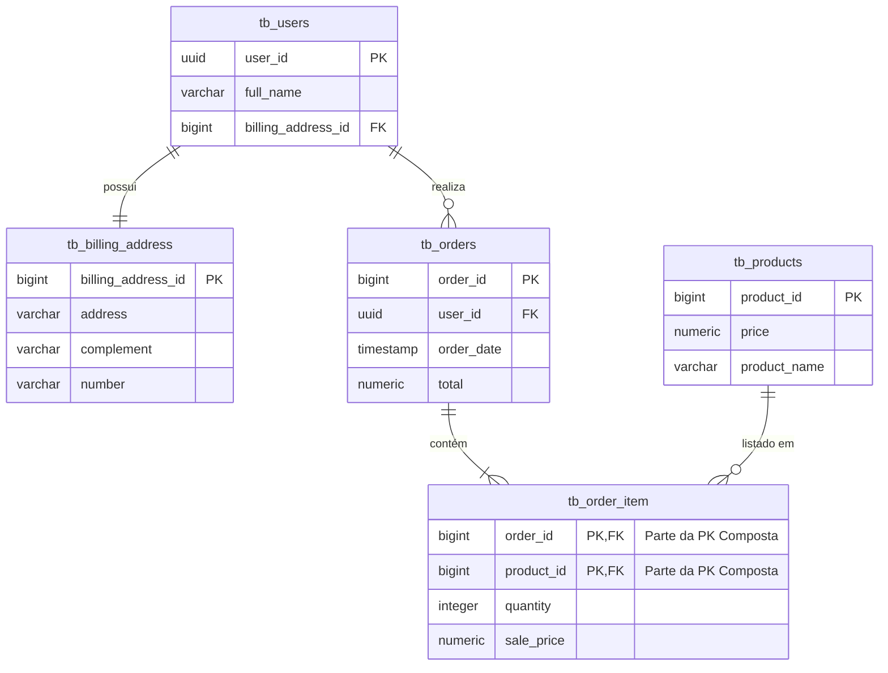

# Diagrama Entidade Relacionamento

```mermaid
erDiagram
    tb_users {
        uuid user_id PK
        varchar full_name
        bigint billing_address_id FK
    }

    tb_billing_address {
        bigint billing_address_id PK
        varchar address
        varchar complement
        varchar number
    }

    tb_orders {
        bigint order_id PK
        uuid user_id FK
        timestamp order_date
        numeric total
    }

    tb_products {
        bigint product_id PK
        numeric price
        varchar product_name
    }

    tb_order_item {
        bigint order_id PK,FK "Parte da PK Composta"
        bigint product_id PK,FK "Parte da PK Composta"
        integer quantity
        numeric sale_price
    }

    tb_users ||--|| tb_billing_address : "possui"

    tb_users ||--o{ tb_orders : "realiza"

    tb_orders ||--|{ tb_order_item : "contém"

    tb_products ||--o{ tb_order_item : "listado em"
```
