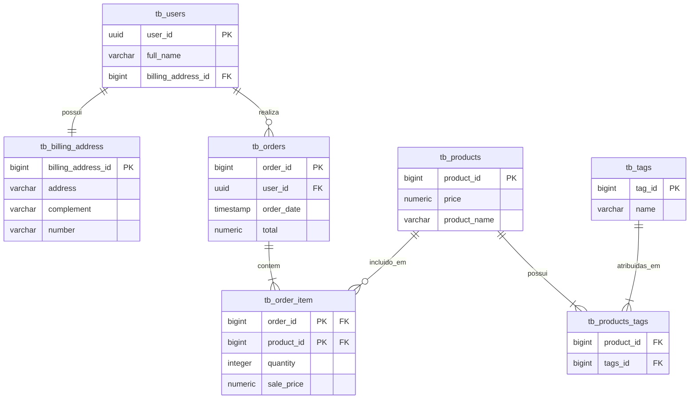

# Diagrama Entidade Relacionamento

```mermaid
erDiagram
    tb_users {
        uuid user_id PK
        varchar full_name
        bigint billing_address_id FK
    }

    tb_billing_address {
        bigint billing_address_id PK
        varchar address
        varchar complement
        varchar number
    }

    tb_orders {
        bigint order_id PK
        uuid user_id FK
        timestamp order_date
        numeric total
    }

    tb_products {
        bigint product_id PK
        numeric price
        varchar product_name
    }

    tb_order_item {
        bigint order_id PK "FK"
        bigint product_id PK "FK"
        integer quantity
        numeric sale_price
    }

    tb_tags {
        bigint tag_id PK
        varchar name
    }

    tb_products_tags {
        bigint product_id FK
        bigint tags_id FK
    }

%% Relacionamentos

%% Users - Billing Address (1 para 1)
    tb_users ||--|| tb_billing_address : possui

%% Users - Orders (1 para N)
    tb_users ||--o{ tb_orders : realiza

%% Orders - Order Items (1 para N)
    tb_orders ||--|{ tb_order_item : contem

%% Products - Order Items (1 para N)
    tb_products ||--o{ tb_order_item : incluido_em

%% Products - Product Tags (Relacionamento N para N via tabela pivo)
    tb_products ||--|{ tb_products_tags : possui
    tb_tags ||--|{ tb_products_tags : atribuidas_em
```
